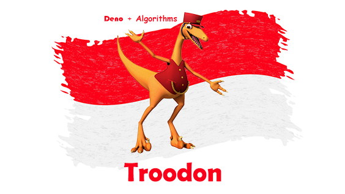

## About Dinosaurs

🦖 Troodon is a lightweight Deno Library to Handle Algorithms

## Project Structure

    Troodon             # Project Name
    ├── Algorithms      # List of Algorithm
    | └── ...
    ├── Examples        # List of Example Algorithm Usage
    │ └── ...
    ├── Tests           # List of Algorithm Test
    │ └── ...
    ├── .gitignore
    ├── LICENSE
    ├── mod.ts          # just import this file to use this library
    ├── README.md
    └── trodoon.jpg     # mascot : Powered by [toppng](https://toppng.com/show_download/65861/dinosaur-train-troodon/large) and [vectorstock](https://www.vectorstock.com/royalty-free-vector/flag-of-indonesia-grunge-abstract-brush-stroke-vector-22275479)

## Features

- [x] [Topsis](https://en.wikipedia.org/wiki/TOPSIS) algorithm.
- [ ] [Analytic Hierarchy Process / AHP](https://en.wikipedia.org/wiki/Analytic_hierarchy_process) algorithm.

## Run Application Example

    deno run ./Examples/TopsisExample.ts

## Run Application Test

deno run ./Test/TopsisTest.ts

## License

The Troodon project is open-sourced software licensed under the [MIT license](LICENSE).
